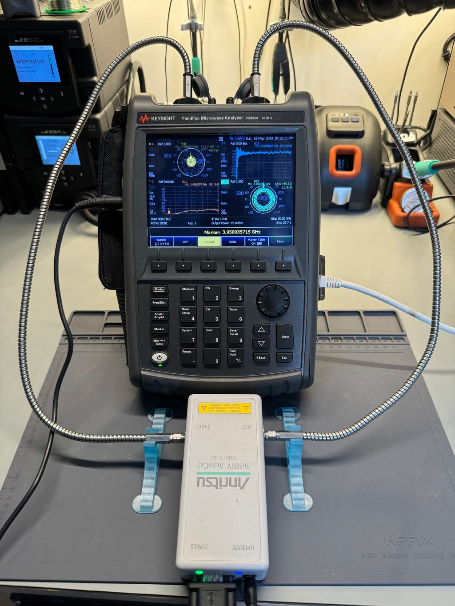

# drift01

- **Date:** 2024-05-19 evening to 2024-05-21 morning
- **Hardware:**
- - Keysight N9952A 50GHz FieldFox
  - Anritsu 3670V50 1.85mm VNA Cable
  - Anritsu 36585V Autocal
- **Calibration:** 85056D 2.4mm Cal Kit, applied to end of VNA cable several hours before experiment start
- **Time:** hours = i*0.260
- **Post-Cal:** Measured the following standards
- - drift01_85056_p1S
  - drift01_85056_p1O
  - drift01_85056_p1L
  - drift01_85056_p2S
  - drift01_85056_p2O
  - drift01_85056_p2L
  - drift01_85056_p12R
 
---
# drift02

- **Date:** 2024-05-21 evening to 2024-05-22 evening
- **Hardware:**
- - Keysight N9952A 50GHz FieldFox
  - Anritsu 36585V Autocal
  - evissaP 1.85mm Cable
- **Calibration:** 85056D 2.4mm Cal Kit, applied to port/cable-end immediately before experiment start
- **Time:** hours = i*0.261
- **Post-Cal:** Did not measure standards post-cal

---
# drift03

- **Date:** 2024-05-22 evening to 
- **Hardware:**
- - Keysight N9952A 50GHz FieldFox
  - Anritsu 36585V Autocal
  - evissaP 1.85mm Cable
- **Calibration:** 85056D 2.4mm Cal Kit, applied to port/cable-end immediately before experiment start
- **Time:** hours = i*0.26
- **Post-Cal:** Did not measure standards post-cal